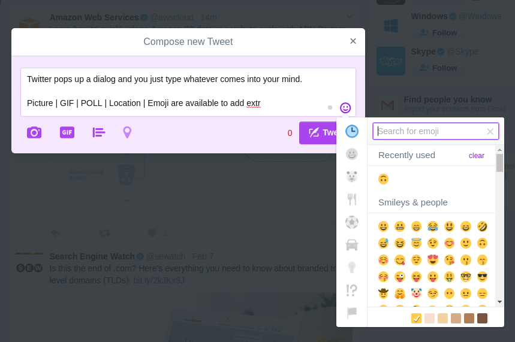

# CRUD in Frontend

<!-- > Created by Fisher at 23:59 on 4th May 2017. -->

[CRUD(Create Read Update Delete)][wiki-crud] operations are the basic for persistent storage. Once one has done too much CRUD operations over HTTP(or-some-kind) together with permission management, which can be tedious sometimes however. One has to rethink about what is being done and do something helpful.

## Basic Activities for Resources

- [GET] Items List
- [GET] Item Detail
- [POST] Post Item
- [PATCH] Update Item
- [DELETE] Delete Item

## Same UI for Posting and Updating?

<!-- Problem: Whether to use the same UI for posting and updating a specific entry. -->

Posting should be easy and accessed with little effort and then users will be more apt to more posting content.

<!-- Solutions: -->

- **Use the same UI.**
	- **Being consistent.** Using the same UI do show consistency.
	- **Fast and convenient coding.** It costs less when a project is newly started.
	- **Code complexity** As the project grows, a lot of If-Else will be involved in the code since we have to be clear about whether the current mission is posting or modifying resource wherever we want to display different UI.
- **Use different UIs.**
	- **Providing more customized UI.** We design different UIs just for different purposes. Designed UIs make users more comfortable.
	- **Repeated codes.** Some codes are shared while some are repeated sometimes, which troubles maintenance.
	- **Resources consuming.** More time and efforts are required to promise users a better experience.

One strategy: use the same UI first and then refactor the codes when either there are a lot of difference or codes become too complex, and often both of them happen at the same time :)

### What Others DO

A lot of applications do not even(for-some-reasons) provide methods to update any posts or maybe you just can edit a little tiny part of the post, e.g., adding a location.

- **Twitter**

 Compose a tweet: Pop up a dialog and you type whatever you comes into your mind.

 

 You can not modify your tweet.

[wiki-crud]: https://en.wikipedia.org/wiki/Create,_read,_update_and_delete "Wikipedia: Create, Read, Update, and Delete"
